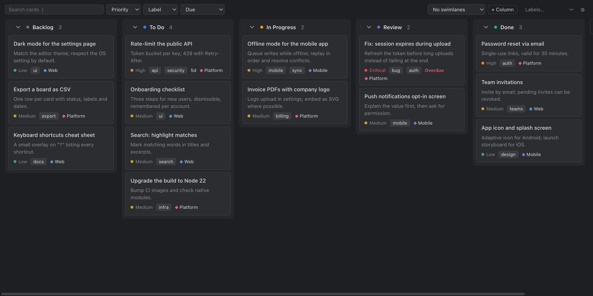
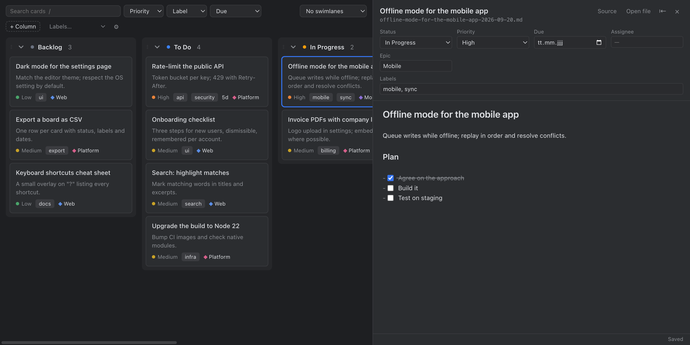
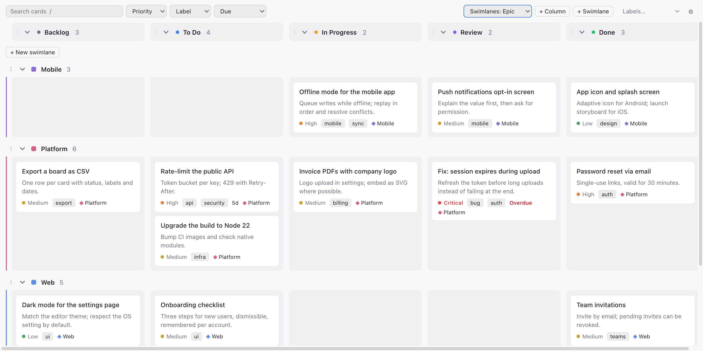

# KanbanBananas

A kanban board for the markdown cards in your repository, built so that your cards never get corrupted, and so that coding agents can work with them safely too.

Each card is a markdown file with a small frontmatter block (status, priority, labels, dates…). The board shows them as columns and lets you drag, edit and search them, while the files stay plain, readable and diff-friendly in git.



## Safe by design

Every change goes through one write path that treats your files with care:

- **Only what changed is touched.** Moving a card edits just its `status` and `order` lines. Quoting, comments, unknown keys, line endings and the body stay byte-for-byte identical.
- **Unsaved edits are respected.** If a card is open in an editor with unsaved changes, the board edits the editor instead of the file, so your changes and your undo history survive.
- **Atomic writes.** Files are written to a temporary file and renamed into place, so a crash never leaves a half-written card. A file that changed on disk since it was read is re-read, never overwritten.
- **Broken files are never written.** Cards that don't parse go to a read-only *Broken* column, and `kanban check` (also as a pre-commit hook) reports them.

## The board

- **Cards:** drag them between and within columns. Right-click a card to set its priority, labels, due date, assignee or epic, move, archive or delete it. The copy button on a card copies its path (as `@path`), ready to paste into an agent's chat.
- **Columns:** add them (**+ Add column**), rename them by clicking the title (you're offered to change the status in their cards to match, e.g. `discovery` for "Discovery", which is what agents use), reorder them by dragging the ⋮⋮ handle, and right-click for colour, moving or archiving all their cards, and deleting. Only the chevron collapses a column.
- **Split view:** click a card to edit it next to the board, in a live-preview markdown editor that saves automatically and never rewrites markdown you didn't touch. Outside changes (the board, a coding agent, another editor) merge into what you're typing; real overlaps ask you to choose. Widen the editor with ⇤.
- **Screenshots:** paste an image into a card, or drag an image file onto it. It's saved next to the board and shown in the editor.
- **Search and filters:** full-text search (`/`), and filters for priority, assignee, label and due date.
- **Swimlanes:** group the board by epic, assignee, priority or a free lane field. Drag cards between swimlanes to change that field; add, rename (click the name) and reorder swimlanes on the board.
- **Housekeeping:** archive and restore cards, rename or delete labels across all cards, rename card files to a new filename pattern.
- Cards opened in VS Code's own editor get a one-line header of their fields.
- Follows your VS Code theme, light or dark. Your view (swimlanes, collapsed columns, filters, editor width) is remembered per project.

**Keyboard:** `N` new card · `/` search · `Esc` close the editor or cancel · `Enter` or `Cmd/Ctrl+Enter` adds a new card.





## Screenshots in cards

Paste a screenshot into a card (or drag an image file onto it) and it's saved as a file, one folder per card: `.devtool/assets/<card-id>/2026-09-29-143012.webp`. The card gets an ordinary markdown link from the project root, ``, which keeps working when the card moves to Done, and shows up in VS Code's preview and on GitHub too.

- Images are stored as lossless WebP by default: pixel-identical to the screenshot, usually a fraction of the PNG size. PNG and a maximum width can be set under **Images** in the settings.
- Pasting into a card opened in VS Code's own editor stores images the same way.
- Deleting a card deletes its images too, except those another card also links to. **Clean Up Unused Images** finds images no card links to any more.
- Many screenshots make a repository grow. **Store Images with Git LFS** sets up Git LFS for the images folder, after explaining what that means for everyone who clones the project.

## For coding agents

KanbanBananas ships a `kanban` command line and an agent skill for coding agents. Agents never edit card files directly: they run `kanban find`, `note`, `move`, `set` and friends, and while VS Code is running, their changes go through the same safe path as the board, including into your open editors.

Run **KanbanBananas: Install / Update Agent Skill** to add it to your project; the board also offers it on first use, and keeps it up to date with the extension. The skill teaches the workflow: log the plan on the card before building, log progress as you go, and a summary when done. A setting decides how far agents may move cards (never, anything but Done, or anywhere), and the CLI enforces it.

**Session memory** (off by default, under *Session memory* in the settings): agents keep a record of where the work stands (what they're working on, what's next, open questions, decisions), shown in the board's top-left corner and opened like a card. When a session is interrupted, the next one reads it and carries on. A `/session-memory` project command asks the agent to save the current state. The file is committed with the project by default; *Personal* keeps it out of git for your clone only.

**Install Pre-commit Hook** adds a check to your git pre-commit hook: a commit that touches cards runs `kanban check` first and stops if a card is broken.

## Getting started

1. Run **KanbanBananas: Open Board**, or click the banana in the activity bar.
2. In a project without a board, choose **Create board** (it makes `.devtool/features/`, with done cards in `done/`) or **Use an existing folder…** for cards you already have.
3. Press `N` for a new card.

A card looks like this:

```markdown
---
id: "offline-mode-2026-09-20"
status: "in-progress"
priority: "high"
assignee: null
epic: "Mobile"
dueDate: null
created: "2026-09-20T09:00:00.000Z"
modified: "2026-09-27T09:00:00.000Z"
completedAt: null
labels: ["mobile", "sync"]
order: "a1"
---
# Offline mode for the mobile app

Queue writes while offline; replay them in order.
```

The format is plain frontmatter plus markdown, so existing boards in this layout open as they are. Don't run two board extensions on the same folder at the same time.

## Settings

Open them from the ⚙ on the board. They're grouped into **Board** (folder, columns, layout, compact mode), **Cards** (which fields cards show), **New cards** (top or bottom, default column and priority, filename pattern), **Swimlanes** (order and colours), **Images** (format, maximum width, folder) and **Agents** (how far agents may move cards, skill location and updates).

## Works remotely

The extension runs where your files are, so it works over Remote SSH, in containers and in WSL. The agent CLI uses Node from your PATH, or the Node that VS Code's remote server ships with.
